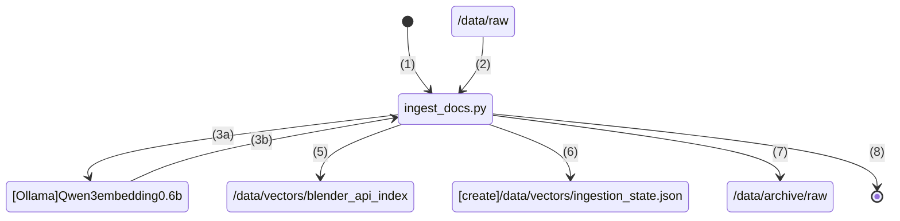

# Ingestion Pipeline

## Summary
In order for the RAG MCP Server to work and be useful, we need data... LOTS of it!

The following instructions will assist you in setting up a data ingestion pipeline that can be regularly triggered and keep your LLM/Agent's knowledge base upto date.

So lets index the following document sets in ChromaDB:
- Latest Blender documentation
- Code Samples
- Templates
- 3D Model Files (Obj, FBX etc...)

## Data Pipeline Sequence Overview:



1. ingest_docs.py script starts
2. documents from ```/data/raw``` are read in
3. each document is chunked with each chunk sent to Ollama Qwen3-embedding:0.6b to get a vector embedding
4. vector embedding is inserted into ChromaDB database. Folder is named **blender_api_api** this will be mounted later to our ChromaDB Docker service
5. ingestion_state.json 
6. documents from ```/data/raw``` are migrated 1 by 1 after processing to ```/data/archive/raw```. (*Note: the folder structure the files belong in are retained)

## Getting Started
### Ollama
We need Ollama hosted locally with the embedding model Qwen3-embedding:0.6b pulled - as of this moment it uses MLX on MacOS which is hitting Apple Silicon GPUs.

We could use the Ollama Service in a docker container except Docker is CPU bound and creating embeddings is super slow in comparison.

### Pipeline Initialisation
To start, we need our pipeline processing folders created so at the root of the project  run the script:

```sh
sh ./scripts/init_ingest.sh
```

This will generate the following folder structure for processing documents:
```sh
data
├── archive
│   └── raw
├── raw
└── vectors
```

Where:
- **/data/raw** - contains unprocessed documents
- **/data/archive/raw** - final resting place of the documents once processed
- **/data/vectors** - contains our ChromaDB vector database with the indexed documents

### Data Preparation
####  Retrieve Raw Documents
A small set of documentation is bundled with this repo and is located in ```/kb```

```sh
kb
├── docs
├── samples
└── templates
```

The **/kb** folders are organised:
- **/kb/docs** - empty on initialisation, will be populated later with the latest Blender Python API docs (*see "Get Blender Python API Docs"*)
- **/kb/samples** - some sample python scripts to help object creation
- **/kb/templates** - current working templates from Blender (v5.1.1 as of writing this document)

Feel free to add more data in those folders (they will be copied over later)

#### Get Blender Python API Docs
To retrieve the current Blender Python API documentation and populate ```/kb/docs```, run the following script:

```sh
sh scripts/get-blender-docs-zip.sh
```

(*NOTE: the script will take care of uncompressing and cleaning up*)

#### Loading Raw Data for Ingest Pipeline

In order for our ingest to work, documents must be placed in the ```/data/raw``` folder for the pipeline to pick up.

You can manually copy them here OR run the provided script that will copy everything from **/kb** over to **/data/raw**:
```sh
sh scripts/copy-kb-to-ingest.sh
```

In this example we have a folder called docs/blender_python_reference_5_1. You can add as many document folders in here as you please.

```sh
data
├── archive
│   └── raw
├─ raw
│   ├── docs
│   │   └── blender_python_reference_5_1
│   ├── samples
│   │   └── blender_code_samples_5_1
│   └── templates
│       └── blender_templates_5_1
└── vectors

```

## Build & Run:

To build the Ingest Pipeline, run:
```sh
docker compose --profile manual build ingest
```

To start processing from the terminal and see logs run:
```sh
docker compose --profile manual up ingest
```

or if you want to run it in daemon mode and just run in the container:
```sh
docker compose --profile manual up ingest -d
```

and to view the container logs while process
```sh
docker logs -f blender-kb-ingest
```

## Document Processing Completion

On completion,
- documents are archived in data/archive/raw in the same folder structure.
- a new ChromaDB vector database file is created under data/vectors/
- a ingestion_state.json file is also created to assist with deduplicating documents that have already been processed.

```sh
data
├── archive
│   └── raw
│       ├── docs
│       │   └── blender_python_reference_5_1
│       ├── samples
│       │   └── blender_code_samples_5_1
│       └── templates
│           └── blender_templates_5_1
├── raw
└── vectors
    └── blender_api_index
        ├── 3804e5cc-113e-407d-863d-4b891b981655
        │   ├── data_level0.bin
        │   ├── header.bin
        │   ├── index_metadata.pickle
        │   ├── length.bin
        │   └── link_lists.bin
        ├── chroma.sqlite3
        └── ingestion_state.json
```

## Completion
Well done for making it this far! You're about to bolt on another lobe onto your LLM/Agent harness. Move onto the MCP Server section.

---
Spudmash Media [-] 2026

