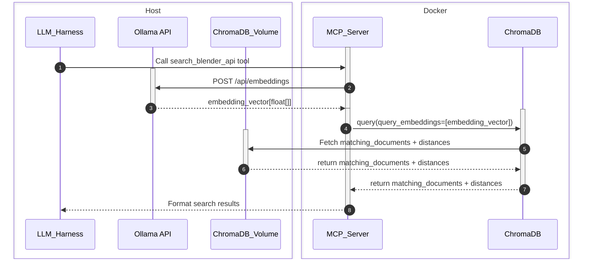
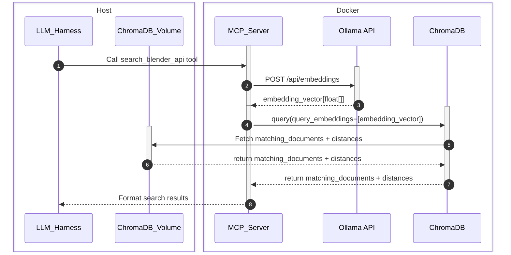

# MCP Server

## Launching MCP Server

There is 2 ways to get the MCP Server running depending on your setup.

### Ollama on Host Machine


This method assumes you are running Ollama directly on your computer which will expose the endpoint ```http://localhost:11434```.

Our MCP Server comprises of 2 Docker container services:
- MCP Service
- ChromaDB Service

both of these services are using a bridged network setup with docker compose.

However in order for MCP Service to be able to tunnel out of it's container and call Ollama on the host machine, it is convered to call the **host.docker.internal** hostname (e.g. ```http://host.docker.internal:11434```).

#### Build Services
```sh
docker compose -f docker-compose.mcp_ollama_host.yml build
```

#### Run Services
```sh
docker compose -f docker-compose.mcp_ollama_host.yml up -d
```

#### Stop Services
```sh
docker compose -f docker-compose.mcp_ollama_host.yml down --volumes --remove-orphans
```

### Ollama in Container (self hosted)



This method assumes you are not running Ollama on the host machine (i.e. You have finished with the ingest, and want to use LM Studio with models from hugging face - don't need Ollama running).

However you do still need Ollama running for the embedding model when you create an embedding of your query to ChromaDB (which is quite a lightweight call compared to ingesting a document) - so we can host it in Docker.

- MCP Service: FastAPI MCP Server
- Ollama Service: Custom ollama Dockerfile that also pulls Qwen3-embedding:0.6b embedding model
- ChromaDB Service: Docker service that points to our database index created during the data ingestion

#### Build Services
```sh
docker compose -f docker-compose.mcp_ollama_container.yml build
```
  
#### Run Services
```sh
docker compose -f docker-compose.mcp_ollama_container.yml up -d
```

#### Stop Services
```sh
docker compose -f docker-compose.mcp_ollama_container.yml down --volumes --remove-orphans
```

## TODO
- In the future for completeness, have the ChromaDB_Volume hosted in a Docker volume to allow for Cloud Hosting.

---
Spudmash Media [-] 2026

